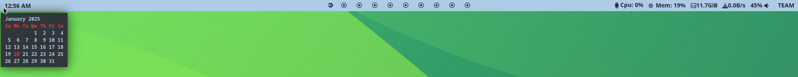

## Waybar Config Files

This is a ready to use Waybar config file. You can download the files in this repository and paste it in `~/.config/waybar` directory of your system.

After that, login and logout to get the changes.

The config is written for Hyprland, so that there are some Hyprland specific commands used. Other desktop users should modify the config according to there needs.

**Screenshot**



## Things to note

Here are some things to note while using the script for Waybar.

### Display Name

The display name used in the cofiguration file is HDMI-A-1. This is because the monitor used was connected via an HDMI port.

For other systems, you should change this to the name of the respective displays. For example, Virtual-1 for Virtualbox displays.

On Hyprland, you can get the name of the display using the command:

```
hyprctl monitors
````
